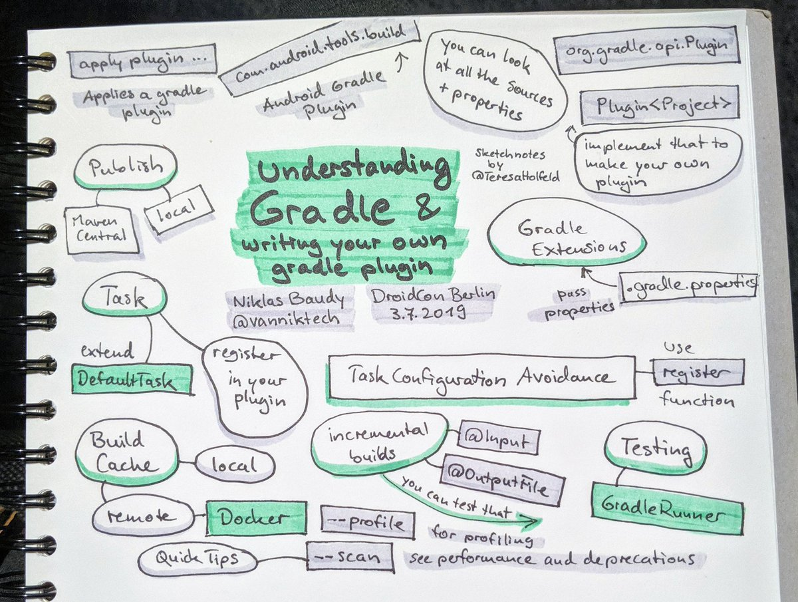

# Intro

## Для чего

Для сборки проекта Java/Kotlin со всеми зависимостями и тп

## User manual

&#x20;[https://docs.gradle.org/current/userguide/userguide.html](https://docs.gradle.org/current/userguide/userguide.html)

