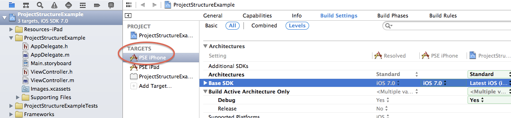

# Xcode: Build Project

## IDE

Xcode - главная среда для разработки под iOS, MacOS ..\
При открытии проекта надо открывать `xcworkspace`, а не `xcproject`!!!\
Старые версии xcode: [https://developer.apple.com/download/more/](https://developer.apple.com/download/more/)

## Структура проекта

Проект состоит из трех частей:

* Targets
* Projects
* Workspaces

### Targets

Определяет как product/binary (т.е. приложение или библиотека) будут собираться. Включает в себя настройки сборки, такие как выбор флагов компилятора и линкера, и определение соотв файлов (исх код и ресурсы). Когда нажимаем Build/Run, мы всегда выбираем один таргет.

Обычно, несокльок таргетов имеют общий код и ресурсы. Различные таргеты могут собираться под различные версии платформ. Таргеты могут быть сгруппированы в **проект**.

### Projects

.png>)

Настройки проекта по дефолту передаются всем включающим его таргетам

Настройки конкретного таргета переписывают настройки Base SDK проекта

В Xcode всегда открываем projects или workspaces, но не таргеты. Однако собираем не проект, а таргет.

### Workspaces

Объединяет в себе несколько проектов.

## Build

xcodegen - генерация XCode проекта из сорцов и Pod файла\
pod install - подтягивание зависимостей  \
xcode open xcworkspace

Версия swift прописана в Podfile. В Xcode ее меняем здесь: **Build Settings**

## Настройка сборок/таргетов

Для того чтобы определить, какую сборку запускать на запуск, билд и тд, заходим в таргеты -> Edit Scheme и там настроиваем&#x20;

## Build IPA on XCode

XCode>Product>Archive - создание архива\
Window->Organize->Archive - билд IPA образа. Как: [https://stackoverflow.com/questions/5499125/how-to-create-ipa-file-using-xcode/47940681](https://stackoverflow.com/questions/5499125/how-to-create-ipa-file-using-xcode/47940681), но выбирать надо Ad-Hoc, потому как если в примере собирать, то будет Beta версия продукта (будет желтая точка около названия такого приложения в телефоне; это иногда может влиять на функциональность).

Важно: проверять, что полученный IPA-образ устанавливается на телефон (были примеры, когда этого не происходило)

